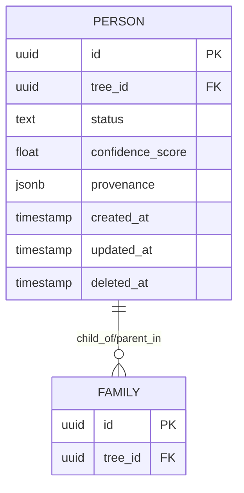

# Модель данных

> **Статус:** черновик. Будет наполнен в Фазе 2 (см. `ROADMAP.md` §6).
> Пока — только наброски и ссылки.

---

## 1. Принципы

- Все «живые» сущности версионируются (audit-log + soft delete).
- На каждой сущности: `confidence_score`, `status`, `provenance`, `version_id`.
- Status: `confirmed | probable | hypothesis | rejected | merged`.
- Provenance — `jsonb`: `{source_files: [...], import_job_id: "...", manual_edits: [...]}`.

---

## 2. Группы таблиц

### 2.1 Сущности (`persons`, `families`, …)

`persons`, `names` (multi на одну персону), `families`, `events`, `places`,
`place_aliases`, `sources`, `source_artifacts`, `citations`, `notes`,
`multimedia_objects`.

### 2.2 ДНК (Фаза 6)

`dna_kits`, `dna_matches`, `shared_matches`, `clusters`, `cluster_members`,
`chromosome_segments`, `person_kit_links`.

### 2.3 Гипотезы и доказательства (Фаза 8)

`hypotheses`, `hypothesis_evidence`, `evidence_artifacts`, `confidence_scores`.

### 2.4 Управление

`users`, `trees`, `tree_collaborators`, `import_jobs`, `review_tasks`,
`audit_log`, `versions`.

### 2.5 Векторы (pgvector)

`person_embeddings`, `place_embeddings`, `document_embeddings`.

---

## 3. ER-диаграмма

> TODO: Mermaid-диаграмма после фиксации схемы в Фазе 2.

---

## 4. Версионирование

См. ADR-0003. На старте — audit-log + snapshot. Переход к bi-temporal — в Фазе 8
(когда появятся гипотезы со сложной историей).

---

## 5. Бенчмарки (целевые)

- Вставка 100 000 персон < 60 сек.
- Запрос предков 10 поколений < 200 мс.

---

## 6. Открытые вопросы

- Графовая БД (Neo4j) для inference-запросов? — пока нет, см. `ROADMAP.md` §24.
- Хранение DNA-сегментов в БД vs Storage? — Storage + кэш (ADR-0006).
